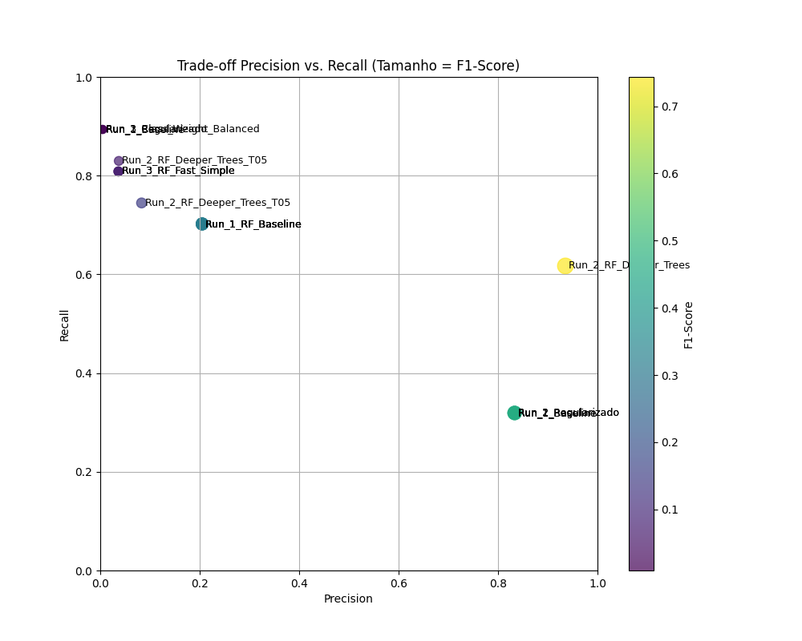

# 💸 Projeto MLOps: Detecção de Fraudes em Transações Financeiras (Synthetic Fraud Detection)

Este projeto demonstra um pipeline MLOps completo, utilizando o **MLflow** para rastreamento, comparação de modelos e otimização de hiperparâmetros, focado em resolver um problema clássico de desbalanceamento de classes: a detecção de fraudes.

## 🎯 Objetivo de Negócio

O objetivo principal era criar um modelo que **minimizasse o Falso Negativo (maximizar o Recall)**, garantindo que o maior número possível de transações fraudulentas fosse capturado, mesmo que isso implicasse em mais Falsos Positivos.

## 💾 Metodologia e Dataset

* **Dataset:** Dataset público de transações sintéticas (`vitaliy-sharandin/synthetic-fraud-detection`).
* **Amostragem:** Para otimizar o tempo de treinamento e demonstrar escalabilidade, foi utilizada uma amostra de **500.000 linhas** (de um total de 6.3M).
* **Desafio:** O dataset apresenta um desbalanceamento severo, com uma taxa de fraude de apenas **0.0466%**.

## 💻 Ferramentas e Arquitetura

* **Framework:** Scikit-learn
* **Rastreamento MLOps:** MLflow (Registrando modelos, métricas e parâmetros)
* **Modelos Testados:** Regressão Logística e Random Forest Classifier

## 📊 Análise de Desempenho e Conclusão

O processo de MLOps permitiu uma comparação rigorosa entre os modelos, focada nas métricas de **Recall** e **Precision** (acurácia é enganosa devido ao desbalanceamento).

### 1. Comparação de Modelos (RF vs. LR)

| Modelo | Recall Máximo | Precision no Recall Máximo |
| :--- | :---: | :---: |
| **Logistic Regression** | **89.36%** | **0.46%** (1 em 217 alertas era real) |
| **Random Forest (Final)** | 82.98% | **3.73%** (1 em 27 alertas era real) |

> **Conclusão:** O **Random Forest (RF)** foi o modelo escolhido. Embora a Regressão Logística tenha atingido um Recall ligeiramente maior (89.36%), sua Precision de apenas 0.46% tornaria o sistema inutilizável (a cada 200 alertas, 199 seriam falsos). O RF, por ser um modelo não linear, conseguiu um Precision 7 vezes maior, sendo significativamente mais confiável na prática.

### 2. Otimização do Threshold (Limiar de Decisão)

O modelo RF final foi ajustado para atingir o objetivo de alta captura de fraudes, utilizando `class_weight='balanced'` e otimizando o limiar (`threshold`) de decisão.

| Parâmetros de Otimização | Precision | Recall | F1-Score | AUC-ROC |
| :--- | :---: | :---: | :---: | :---: |
| **RF Otimizado (Threshold = 0.05)** | 0.0373 | **0.8298** | 0.0714 | **0.9797** |

> **Resultado Final:** A Run com `Threshold = 0.05` foi selecionada como a melhor candidata, pois oferece **82.98% de Recall** (minimizando o Falso Negativo) com uma alta confiança subjacente do modelo, confirmada por um **AUC-ROC de 0.9797** (excelente capacidade de discriminação).

### 3. Justificativa de Escopo (Amostragem)

> **Nota:** Todos os treinamentos foram realizados em uma amostra de **500.000 linhas**. O uso de uma amostra é uma prática de MLOps para reduzir o tempo de iteração e o custo computacional, permitindo que a diferença de desempenho entre os modelos fosse claramente demonstrada. É esperado que o treinamento com o dataset completo de 6.3M amplie ainda mais a superioridade do Random Forest.

### 4. Visualização do Trade-off Precision vs. Recall

O gráfico de dispersão abaixo ilustra o resultado da otimização de modelos e limiares (Thresholds). Cada ponto representa uma Run do MLflow, e o tamanho/cor indica o F1-Score (equilíbrio).

O objetivo era mover os pontos para cima (maior Recall).



## 🔗 Como Visualizar os Resultados

Para revisar todas as 21 iterações de treinamento, métricas e parâmetros registrados, utilize o MLflow UI:

```bash
# Na raiz do projeto, com o venv ativo
mlflow ui
```

## 🔚 Conclusão:

Embora o escopo inicial envolvesse modelos lineares como a Regressão Logística (LR), o teste inicial com a LR demonstrou sua ineficácia diante do severo desbalanceamento (Precision < 1%). Por essa razão, o projeto escalou para o Random Forest Classifier, um modelo não linear mais robusto, que provou ser a ferramenta correta, alcançando um Precision 7x maior e um AUC-ROC de 0.9797, provando a superioridade do modelo para este domínio financeiro.
